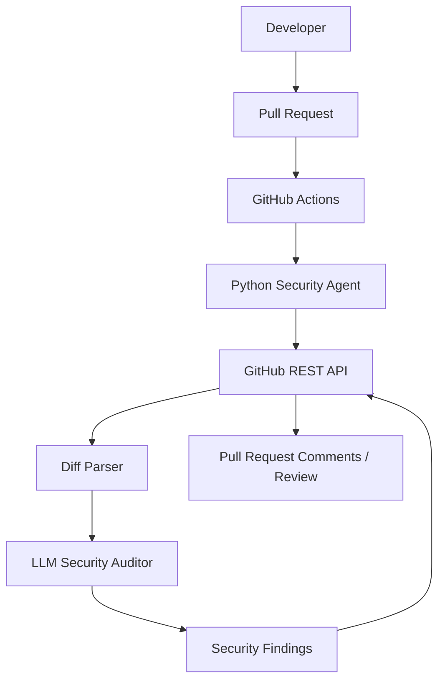

# Autonomous CI/CD Code Security Agent

A GitHub Actions security gate that analyzes added and modified pull request lines with an LLM auditor, posts a Markdown report to the pull request, and adds line-specific review comments when GitHub accepts the locations.

## Project Overview

The agent retrieves changed-file patches from the GitHub REST API. It ignores deleted and unchanged code, sends only added lines to an OpenAI-compatible LLM endpoint, validates the strict JSON response, and publishes actionable findings. `CRITICAL` and `HIGH` findings make the workflow fail; `MEDIUM`, `LOW`, and clean reviews pass.

## Architecture



## How the Workflow Works

1. `opened`, `synchronize`, `reopened`, and `ready_for_review` pull request events start the workflow.
2. The agent requests the pull request's changed files and patches.
3. Added lines are mapped to current-file line numbers. Deleted lines, binary files, and empty patches are ignored.
4. The analyzer sends a small, structured prompt to the configured LLM API.
5. The response is validated before any result is posted.
6. A marked summary comment is created or updated. Findings with changed-line locations are also submitted as review comments.
7. The process exits with code 1 for `CRITICAL` or `HIGH` findings and code 0 otherwise.

## Technology Stack

- Python 3.11+
- GitHub Actions and GitHub REST API
- `requests`
- OpenAI-compatible LLM REST API
- Git and YAML
- `pytest`

## Project Structure

```text
.github/workflows/security-agent.yml  GitHub Actions entry point
src/__init__.py                        Python package marker
src/github_client.py                   GitHub REST API client
src/diff_parser.py                     Unified diff and line extraction
src/security_analyzer.py               LLM request and strict JSON validation
src/report_generator.py                Markdown report formatting
src/main.py                             CLI orchestration
tests/                                  Mocked unit tests
requirements.txt                        Runtime and test dependencies
.env.example                            Local configuration template
```

## GitHub Setup

1. Create a repository on GitHub, for example `autonomous-ci-cd-security-agent`.
2. From this project directory, initialize and push the code:

```bash
git init
git add .
git commit -m "Add autonomous CI/CD security agent"
git branch -M main
git remote add origin https://github.com/YOUR-USER/autonomous-ci-cd-security-agent.git
git push -u origin main
```

3. In GitHub, open **Settings > Secrets and variables > Actions**.
4. Add the required repository secret `LLM_API_KEY`.
5. Add `LLM_API_URL` as a secret if it is not the default OpenAI-compatible endpoint. It may also be configured as a repository variable.
6. `GITHUB_TOKEN` is created automatically by GitHub Actions; do not create or hardcode it.
7. In **Settings > Actions > General**, allow the workflow to create and approve pull request comments if your organization requires that setting.

The workflow requests only `contents: read` and `pull-requests: write`. It uses `pull_request`, not `pull_request_target`, so untrusted fork code cannot run with repository secrets. GitHub does not provide repository secrets to forked pull requests; those runs are explicitly skipped and logged.

## Required Secrets and Variables

| Name | Location | Purpose |
| --- | --- | --- |
| `GITHUB_TOKEN` | Automatic Actions secret | GitHub API authentication |
| `LLM_API_KEY` | Repository secret | LLM API authentication |
| `LLM_API_URL` | Secret or repository variable | OpenAI-compatible chat endpoint |
| `LLM_MODEL` | Repository variable | Optional model name, default `gpt-4o-mini` |

For local work, copy `.env.example` to `.env` and export the values in your shell. The application intentionally does not load `.env` automatically, avoiding an extra dependency and keeping secret loading explicit.

## Local Development

Use Python 3.11 or newer:

```bash
py -3 -m venv .venv
.venv\Scripts\Activate.ps1
python -m pip install -r requirements.txt
$env:GITHUB_TOKEN = "your-token"
$env:LLM_API_KEY = "your-key"
$env:LLM_API_URL = "https://api.openai.com/v1/chat/completions"
$env:GITHUB_REPOSITORY = "owner/repository"
$env:GITHUB_PR_NUMBER = "1"
python -m src.main
```

A fine-grained GitHub token used locally should have repository contents read access and pull request read/write access. Prefer the Actions-provided `GITHUB_TOKEN` in CI.

## Tests

Tests mock all external API calls and require no credentials:

```bash
python -m pytest -q
```

The suite covers GitHub response handling, pagination-compatible file retrieval, unified diff parsing, binary and empty diffs, LLM JSON schema validation, invalid responses, API failures, and report generation.

## LLM Configuration

The analyzer expects an OpenAI-compatible `POST` endpoint. It sends `model`, `temperature: 0`, `response_format: {"type": "json_object"}`, and `messages`. The endpoint must return a chat completion containing JSON in `choices[0].message.content`.

The required response shape is:

```json
{
  "findings": [
    {
      "file": "app.py",
      "line": 25,
      "severity": "HIGH",
      "type": "SQL Injection",
      "description": "User-controlled input is directly concatenated into a SQL query.",
      "recommendation": "Use parameterized queries instead of string concatenation."
    }
  ]
}
```

The prompt asks the auditor to investigate injection, credentials, authentication and authorization, IDOR, path traversal, SSRF, unsafe deserialization, cryptography, sensitive data, API usage, input validation, shell execution, and dependency/security configuration issues. It also tells the model to avoid unsupported theoretical findings.

## Example Pull Request Workflow

A developer opens a pull request that adds a raw SQL query using request input. The workflow retrieves the patch, identifies the added line, asks the auditor for strict JSON, and updates a comment like this:

```text
# Code Security Analysis

Status: FAIL - Security issues detected.

| Severity | Type | File | Line |
| --- | --- | --- | ---: |
| HIGH | SQL Injection | app.py | 25 |

## HIGH - SQL Injection

File: app.py
Line: 25

Issue:
User-controlled input is directly inserted into a SQL query.

Recommended Fix:
Use parameterized queries.
```

The job fails, preventing a required status check from passing until the code is fixed. A clean pull request receives a `PASS` report and the job exits successfully.

## Security Considerations

- Never commit `.env`, tokens, API keys, or real credentials.
- Do not change this workflow to `pull_request_target` unless the workflow is carefully reviewed; that event can expose base-repository secrets while operating on attacker-controlled changes.
- Only changed lines are sent to the LLM, reducing data exposure and cost.
- LLM output is treated as untrusted data and schema-validated before publication.
- Review comments are best-effort because GitHub rejects locations that are not valid changed lines.
- Treat LLM findings as an additional security control, not a replacement for tests, review, SAST, dependency scanning, and runtime controls.
- Use an LLM provider with an appropriate data-retention policy for your source code.

## Future Improvements

- Add provider adapters for additional LLM APIs.
- Add SARIF output for GitHub Code Scanning.
- Cache repeated patch analyses and redact configurable sensitive patterns before sending.
- Add confidence scores and deduplication across review runs.
- Add a repository policy file for severity thresholds and excluded paths.
- Use GitHub's Checks API for richer annotations and summaries.
